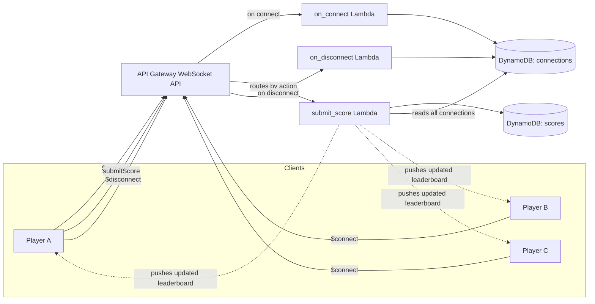

# live-leaderboard

A real-time multiplayer reaction-time game with a **live-updating leaderboard**, built on WebSocket infrastructure — the one architectural pattern missing from this author's other AWS projects (which use request/response and event-driven queues, but never a persistent, server-push connection).

When any player submits a score, every other connected player's leaderboard updates **instantly**, with no refresh and no polling — the server pushes the update the moment it happens.

## Architecture



## How it works

1. **Connect** — when a browser opens a WebSocket connection, API Gateway's built-in `$connect` route fires `on_connect`, which saves that connection's unique ID to DynamoDB.
2. **Play** — the game (a simple reaction-time clicker) measures how fast the player clicks after the screen turns green.
3. **Submit** — the client sends `{"action": "submitScore", ...}` over the open connection. API Gateway's route selection reads the `action` field and invokes `submit_score`.
4. **Broadcast** — `submit_score` saves the score (only if it beats the player's previous best), then reads every currently-connected client from DynamoDB and **pushes** the updated top-10 leaderboard directly to each one, using API Gateway's `@connections` management API — no client has to ask for it.
5. **Disconnect** — when a tab closes, `$disconnect` fires `on_disconnect`, cleaning up that connection ID so future broadcasts don't waste time on dead connections.

## Why this is architecturally different from this author's other projects

- **`infra-provisioner`**: synchronous request → response (client asks, server answers, connection closes)
- **`pixel-pipeline`**: asynchronous, but event-driven through a queue (S3 event → SQS → worker), not a persistent connection
- **`live-leaderboard`**: a genuinely different pattern — **server-initiated push** over a connection that stays open. The server decides when to send data, not the client.

## Tech stack

- **Terraform** — DynamoDB tables, all three Lambda functions, the WebSocket API Gateway and its routes/integrations, IAM roles
- **API Gateway WebSocket API** — persistent connections, custom route selection via message content
- **AWS Lambda** (Python 3.12) — three functions, each scoped to least-privilege IAM permissions
- **DynamoDB** — tracks active connections and best scores per player
- **pytest** — unit tests for all three Lambda functions, using mocked AWS calls (no real AWS credentials or costs needed to run them)

## Cost

Every service here is pay-per-use — there is nothing that bills simply for existing (unlike, for example, a load balancer or a database instance). API Gateway WebSocket connections are also automatically closed by AWS after 10 minutes of inactivity or 2 hours maximum duration, so there's no scenario where a forgotten open tab accumulates meaningful cost. At the usage level of testing and demoing this project, cost is effectively $0.

## Project structure
live-leaderboard/
├── lambda/
│ ├── on_connect/
│ ├── on_disconnect/
│ └── submit_score/
├── terraform/
│ ├── main.tf
│ └── variables.tf
├── tests/
│ ├── test_on_connect.py
│ ├── test_on_disconnect.py
│ └── test_submit_score.py
└── frontend/
└── index.html


## Running this project

1. `cd terraform && terraform init && terraform apply`
2. Copy the `websocket_url` output into `frontend/index.html` (the `WS_URL` constant)
3. Open `frontend/index.html` in two separate browser tabs
4. Enter a name and play in one tab — watch the leaderboard update live in the other, with no refresh

## Running the tests

```bash
pip3 install pytest
python3 -m pytest tests/ -v
```

## Possible future work

- Persist a full match history, not just each player's best time
- Add a "currently online" player count, pushed live alongside the leaderboard
- Rate-limit score submissions to prevent spamming
- A proper CI pipeline running `pytest` on every push
